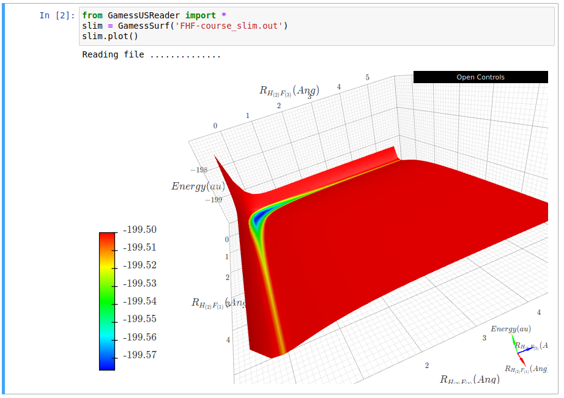
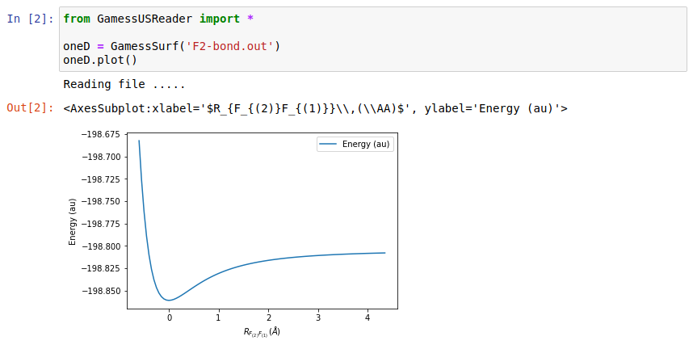

### GamessUSReader.py
This file contains utilities for extracting data from [GAMESSUS](https://www.msg.chem.iastate.edu/gamess/) output files (.log or .out). Current capabilities:

* Read data from potential energy surface calculations. Once data is loaded into a GamessSurf object it can be plotted with the simple `.plot()` extension. 2-D surfaces are plotted as live 3-D projections using [k3d-jupyter](https://github.com/K3D-tools/K3D-jupyter). 1-D surfaces are plotted in a 2-D plot using [pandas](https://pandas.pydata.org/) and [matplotlib](https://matplotlib.org/).

Try it in 

To use have the file `GamessUSReader.py` in the current working directory. You also need jupyter, numpy, k3d, pandas and matplotlib modules installed.

Installing the modules in your virtual environment is best done using pip:

`pip intall -U jupyter numpy pandas k3d matplotlib`

__Examples__

